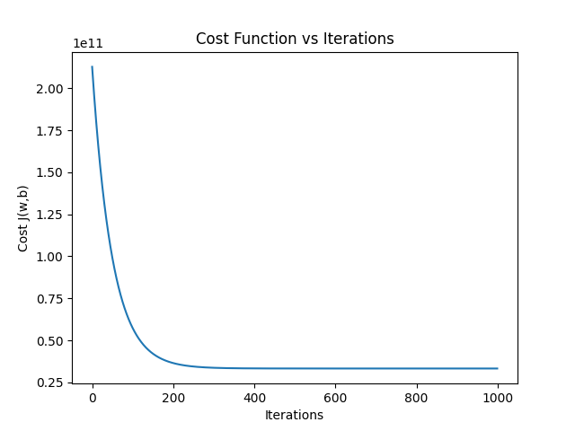

# House Price Prediction Using Linear Regression

## Overview

This project implements univariate linear regression from scratch using Python, NumPy, Pandas, and Matplotlib.

The objective is to predict house prices using the `living area` feature and understand the complete training process behind linear regression rather than using a machine-learning library.

## Dataset

The project uses the House Price India dataset.

- Number of records: 14,621
- Input feature: `living area`
- Target variable: `Price`

The dataset is loaded from a CSV file using Pandas.

## Machine Learning Approach

The model used is linear regression:

y_hat = wx + b

where:

- `x` is the living area
- `y_hat` is the predicted price
- `w` is the model parameter
- `b` is the bias

### Cost Function

The Mean Squared Error based cost function used for training is:

J(w,b) = (1 / 2m) * sum((y_hat_i - y_i)^2)

where `m` is the number of training examples.

### Gradient Descent

The partial derivatives used to update the parameters are:

dJ/dw = -(1/m) * sum((y_i - y_hat_i) * x_i)

dJ/db = -(1/m) * sum(y_i - y_hat_i)

The parameters are updated using:

w = w - alpha * dJ/dw

b = b - alpha * dJ/db

where `alpha` is the learning rate.

## Feature Scaling

Initially, gradient descent was applied directly to the raw `living area` values. This caused the parameters and cost to grow rapidly because the feature values were on a relatively large numerical scale.

To stabilize gradient descent, standardization was applied:

X_scaled = (X - mean(X)) / std(X)

The scaled feature was then used for prediction and gradient calculation.

## Training Configuration

- Learning rate: `0.01`
- Iterations: `1000`
- Initial `w`: `0`
- Initial `b`: `0`
- Optimization: Batch Gradient Descent

## Result

The following graph shows the cost decreasing rapidly during the initial iterations and then approaching a stable value.

The decreasing cost demonstrates that the implemented gradient descent process is reducing the model's training error and converging toward a stable parameter region.

## Libraries Used

- NumPy
- Pandas
- Matplotlib

## Current Scope

This version focuses on understanding and implementing the fundamentals of linear regression and gradient descent from scratch.

It intentionally uses a single feature, `living area`, to keep the mathematical implementation clear.

Future extensions can include multiple linear regression using the other relevant housing features, prediction evaluation, and additional visualizations.
